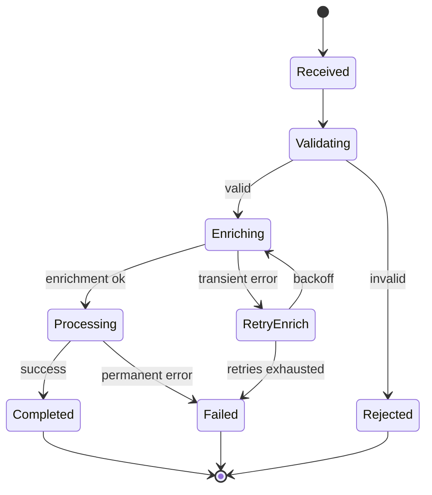

# Workflow tree — template

## Header
- **Workflow name**:
- **Owner**:
- **Trigger**: what starts this workflow (event, schedule, user action)
- **Outcome**: what success looks like in one sentence

## State diagram (text representation; render with Mermaid / Graphviz)

## State table

| State | Entry condition | Expected input | Allowed transitions | On failure | Observability |
|---|---|---|---|---|---|
| Received | Trigger fired | <payload schema> | Validating | log + alert if cannot enter | counter: workflow_started |
| Validating | from Received | n/a | Enriching, Rejected | → Rejected with reason | counter: validation_pass/fail |
| Enriching | from Validating, valid | <enrichment fields> | Processing, RetryEnrich | → RetryEnrich (max 3) | histogram: enrich_latency |
| RetryEnrich | from Enriching, transient | n/a | Enriching, Failed | → Failed | counter: enrich_retries |
| Processing | from Enriching, enriched | <full record> | Completed, Failed | → Failed with reason | histogram: process_latency |
| Completed | from Processing | result | [terminal] | n/a | counter: workflow_completed |
| Rejected | from Validating | reason | [terminal] | n/a | counter: workflow_rejected{reason} |
| Failed | any | error | [terminal] | DLQ + alert | counter: workflow_failed{phase} |

## Handoff contracts (one per cross-system boundary)

### Handoff: this workflow → downstream X
- **Payload schema**: <link to schema file>
- **Idempotency key**: `<key field>` (must be unique per logical operation)
- **Versioning**: `schema_version: int`; receiver supports ≥ 3
- **Error contract**:
  - 400 — permanent failure, do not retry
  - 409 — duplicate, treat as success
  - 5xx — transient, retry with exponential backoff (max 5)
- **At-most / at-least / exactly-once**: at-least-once with idempotency key

## Timeouts
| Where | Timeout |
|---|---|
| External call to X | 5s |
| Wait-for-event Y | 24h, then escalate |
| User-input gate Z | 7d, then abort |
